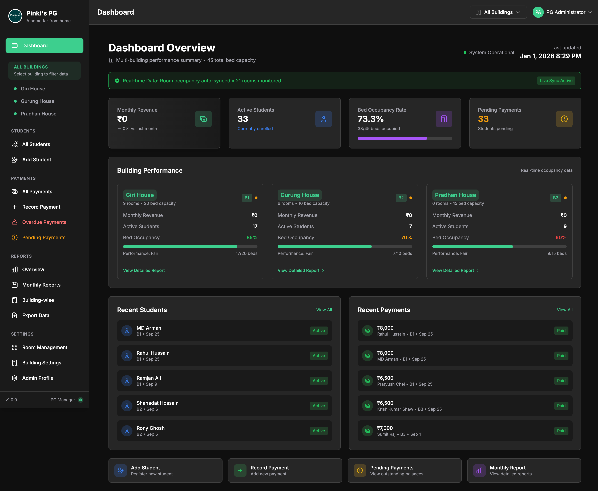

# PG Management Dashboard 🏠

## Overview
A full-stack dashboard designed for Paying Guest (PG) managers to streamline daily operations. This application acts as a centralized hub to manage tenants and monitor the financial health of the business.

## Key Features
* **Student Management:** Store and manage student/tenant details efficiently.
* **Financial Tracking:** Record rent payments, track dues, and calculate overall revenue with detailed monthly reports.
* **Modern UI:** Responsive and clean design built with Tailwind CSS.
* **Cloud Backend:** Powered by Supabase for secure data storage and backend logic.

## Tech Stack
* **Frontend:** PHP, JavaScript, Tailwind CSS
* **Backend & Database:** Supabase